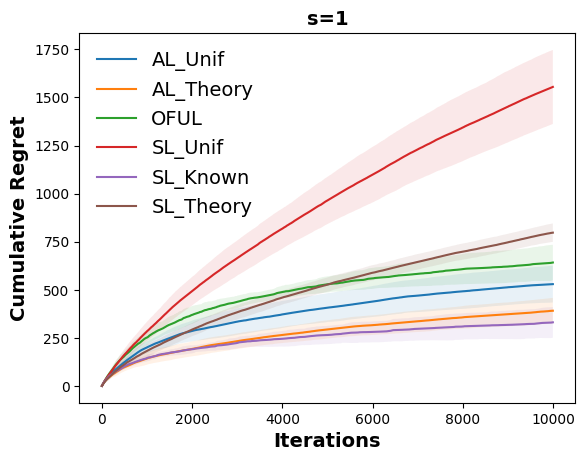
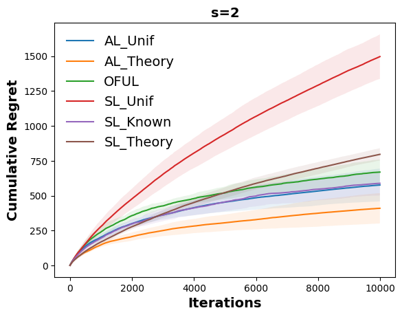
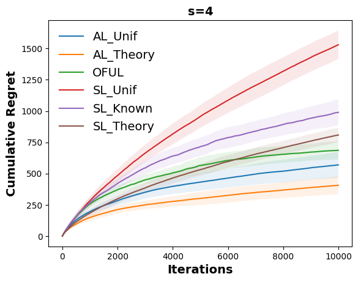
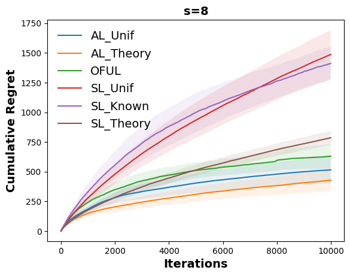
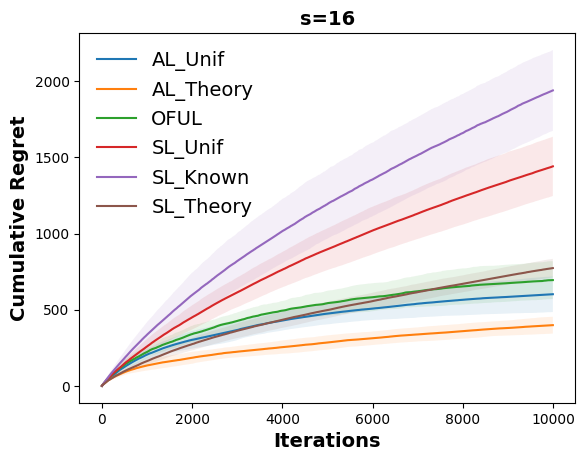

# Sparsity-Agnostic Linear Bandits with Adaptive Adversaries

This repository is the official implementation of 'Sparsity-Agnostic Linear Bandits with Adaptive Adversaries'. 


In this section we describe some experiments we performed on synthetic data to verify whether **AdaLinUCB** performs better than **OFUL**. We also test the empirical performance of **SparseLinUCB** on the same data (additional details on all the algorithms and the experimental setting are in Appendix E). Note, however, that our experiments are designed to test the impact of model selection as opposed to the impact of sparsity. This is because no efficient implementation of **seqsew** is known, and so we cannot implement the online to confidence set approach as described in our paper. Instead, we run **AdaLinUCB** and **SparseLinUCB** with $\hat{X}_t = X_t$ for all $t\in [T]$. Due to our choice of the confidence sets, the setting $\hat{X}_t = X_t$ implies that both algorithms implement a randomized model selection procedure over instances of **OFUL** with different choices of radius $\alpha_i$ for $i\in [n]$. 


## Requirements

We used Python 3.11.9 for this experiment. 

To create a conda environment:

```setup
conda create --name <env> --file requirements.txt
```

## Training and evaluation

Our code is in a Jupyter Notebook-based IPYNB file, with detailed instructions included within the code. Please read the explanations from the top and proceed by pressing Shift+Enter.

Or you can simply run the following code:

```Execute
jupyter nbconvert --execute NeurIPS2024_exp.ipynb
```
and check the image files 'Fixed_action_set_s(sparsity level).png' for the results. 

## Results

Our model achieves the following performance:







As we do not use **SeqSEW** for efficiency reasons, our implementations are not sparsity-aware. Indeed, only the performance of SparseLinUCB_Known is affected by the sparsity level.
The theory-driven choice of $\{q_s\}_{s\in [n]}$ (**SparseLinUCB\_Theory**) performs better than the uniform assignment (**SparseLinUCB\_Unif**), and is in the same ballpark as **OFUL**. On the other hand, **AdaLinUCB\_Unif** and **AdaLinUCB\_Theory** outperform all the competitors, including **OFUL**. This provides evidence that using **Exp3** for adaptive model selection may significantly boost the empirical performance of stochastic linear bandits.